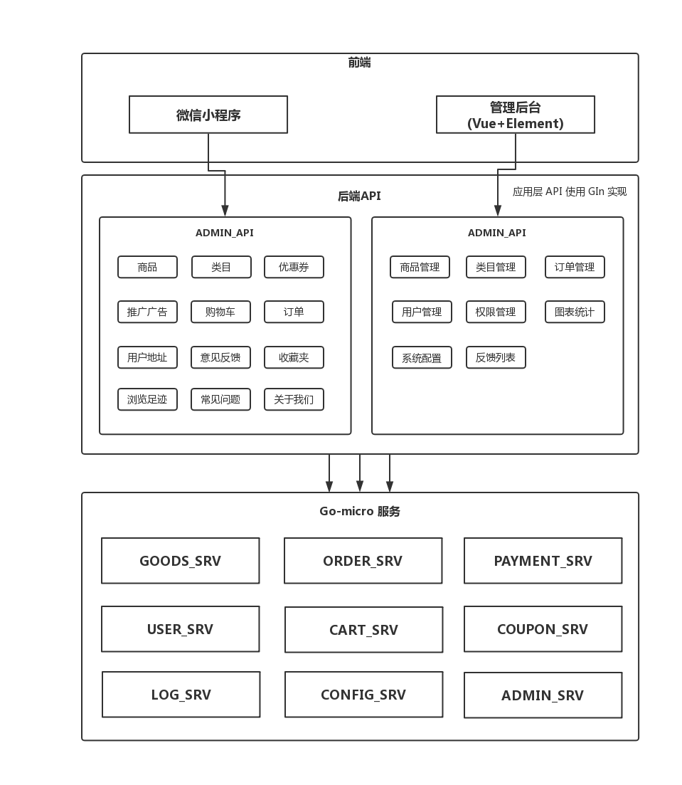

## 基于Gin和Vue实现的前后端分离的电商系统  

## 项目结构

- shop-deploy 项目 Docker 环境
- shop-page-admin  管理后台
- shop-page-app   移动端界面（基于uni-app）
- shop-page-pc    PC端页面
- shop-page-admin 后端界面
- shop-service   相关的服务端
- shop-axure    原型设计

## 功能

## 移动端（小程序）
- 首页
- 商品分类
- 商品列表，商品详情
- 商品热卖推荐、新品推荐
- 浏览足迹，商品收藏
- 购物车
- 个人中心
- 订单列表、详情
- 地址管理
- 意见反馈
- 订单商品评价
- 优惠券

## PC端 
- 首页
- 商品分类
- 商品列表，商品详情
- 商品热卖推荐、新品推荐
- 浏览足迹，商品收藏
- 购物车
- 个人中心
- 订单列表、详情
- 地址管理
- 意见反馈
- 订单商品评价
- 优惠券

## 管理后台

- 商品管理
- 分类管理
- 订单管理
- 用户管理
- 权限管理
- 图表统计
- 系统配置

                                                                                                                                                      
## 模块架构

项目实现前后分离，后端采用 go-micro 实现微服务化

              
